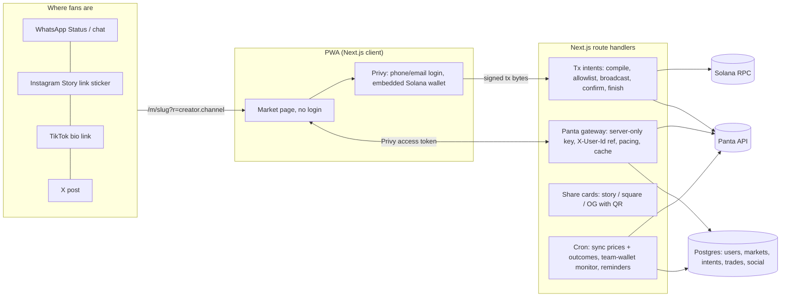

# Zan — technical notes

## Architecture

- **Panta is the source of truth** for prices, phases, positions and outcomes of real-money markets. Our database owns identity, the social layer, attribution, integrity lists, free calls and a price history (Panta keeps none).
- **The API key never reaches the browser** (`src/lib/panta/client.ts` is `server-only`). Paths always end with `/`.
- **No custody.** The server prepares unsigned bytes, the user's wallet signs (Privy `useSignTransaction`), the server broadcasts on its own RPC and finishes the Panta bookkeeping.

## Panta endpoints and where they're used

| Endpoint | Used by | Notes |
| --- | --- | --- |
| `GET /markets/?status=primary&category=&cursor=` | `/api/catalog` → Explore | List rows carry no prices (by design) |
| `GET /markets/{id}/` | `syncMarket`, `/api/catalog/{id}`, positions valuation | Cached ~8 s; retried once when the title comes back empty |
| `GET /markets/{id}/trades/` | `/api/markets/{slug}/activity` | Amounts bucketed for privacy |
| `GET /wallets/{wallet}/trades/` | Cron team-wallet monitor | Flags creator markets traded by restricted wallets |
| `POST /markets/create/image-upload/` | `/api/create/image`, `/api/create/cover` | Signed upload; cover is rendered server-side then uploaded |
| `POST /markets/create/quote/` | `/api/create/quote` | Creator's own wallet is `wallet` (it owns creator fees) |
| `POST /markets/create/build/` | `/api/create/build` | Re-quotes automatically on `CREATE_EXPIRED`; tx checked, never modified |
| `POST /markets/register/` | `finish()` after confirmation | Retries `TX_NOT_FOUND`; idempotent |
| `POST /primaryorderquote/` | `/api/trade/quote` | Carries `userId` = referral code |
| `POST /primaryorderbuild/` | `/api/trade/build` | Instructions compiled server-side into a v0 tx paid by the fan |
| `POST /primaryordersubmit/` + `POST /primaryorderverify/` | `finish()` | Verify polled up to ~12 s |
| `POST /trades/` | `finish()` for buys and win claims | Explicit attribution with `userId`; never for creator-fee claims |
| `GET /positions/?wallet=` | `/api/positions`, outcome discovery | Rows give `claimable`, `claimed`, `outcome` |
| `POST /claim/build/` | `/api/claim/build` (kind `claim`) | Then reported to `/trades/` |
| `POST /claim/creator-fees/build/` | `/api/claim/build` (kind `creator_fee`) | `MARKET_NOT_GRADUATED` / `NO_CREATOR_FEES` shown as states |
| `GET /account/dashboard/` | `/api/traction` | Attributed volume next to our own numbers |

Rate limits (per account per minute: read 120, positions 60, quote 30, build 20, register 40, upload 10) are paced per server instance in `src/lib/panta/limiter.ts`; 429s are retried with `Retry-After`.

## Transaction pipeline (`src/lib/tx.ts`)

Each money-moving action is a `tx_intents` row: `quoted → built → sent → confirmed | failed | expired`.

1. **Quote / build** on the server. Buy and claim instructions are checked against an allowlist (Panta program IDs from `PANTA_PROGRAM_IDS`, System, SPL Token, Token-2022, ATA, Compute Budget, Memo) and every signer must be the user's wallet. The create transaction from Panta is inspected (single signer = creator, allowed programs) and passed through unmodified.
2. **Sign** in the browser with the embedded or connected wallet.
3. **Submit**: `/api/tx/submit` checks the signed message is byte-for-byte what was prepared, broadcasts on `SOLANA_RPC_URL`, and waits for confirmation (~40 s; `/api/tx/status` resumes after that).
4. **Finish** (idempotent): buy → Panta submit + verify + `/trades/`; claim → `/trades/`; create → `/markets/register/` and the market goes live; creator fee and withdraw → nothing else.

Real-money gates run on every quote: country from the hosting edge (unknown fails closed), 18+ attestation, restricted traders, daily limit, break and self-exclusion.

## Data model (`src/lib/db/schema.ts`)

`users`, `wallets`, `social_accounts` (verified via Privy OAuth), `creator_profiles`, `restricted_traders`, `markets` (kind `panta` | `forecast`, tier, creator call, phase, outcome, synced prices), `market_snapshots`, `tx_intents`, `trades` (with referral creator/channel and exclusion reason), `forecasts` (free calls), `follows`, `comments` (+ `comment_reports`), `reactions`, `share_events` (share and visit funnel), `play_limits`, `notifications`.

## Referral codes

`?r=<creator>.<channel>[.<sharer>]`, channels `wa_chat | wa_status | ig_story | tt_bio | x_post | qr | copy | native`. The proxy stores the first valid code in an http-only cookie; the market page records a visit; quotes send `zan:<code>` to Panta as `X-User-Id`/`userId`; the trade row stores creator and channel for the funnel.

## Open questions for Panta

1. Is graduation still live, what's the threshold, and do API buys stop at it? (The app treats `MARKET_NOT_IN_PRIMARY` as a normal state and links to panta.market.)
2. Creator share: percentage of fees or of the pool, and does a lopsided market reduce it?
3. Payout: a fixed 1 USDC per winning share, or a pro-rata pool? (Copy says "about" and uses the claim build amount.)
4. Dispute window length and cancellation/refund flow.
5. Can partner keys get higher rate limits (20 builds/min caps the whole app)?
6. Which `userId` formats are accepted (we send `zan:<creator>.<channel>[.<sharer>]`, ≤64 chars)?
7. Can a sponsor wallet pay network fees on compiled buy/claim transactions without failing verification?
8. Which program ID is current (`6gM5afTQ…` or `4CQ4LWv7…`)? Both are allowlisted.
9. Restricted-jurisdiction list and integrator KYC duties.
