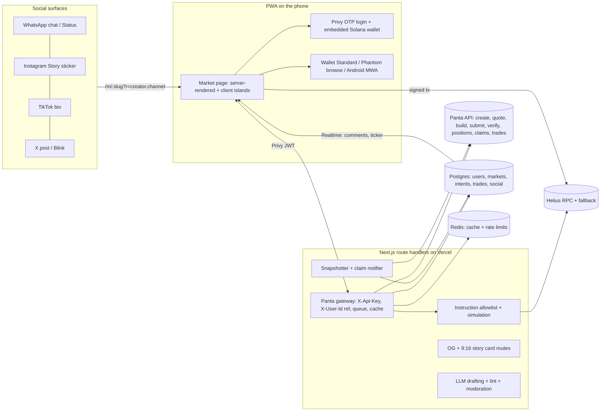

# Turn creator hot takes into Panta markets

The team can ship a credible creator-led prediction-market app on Panta before the **12 October 2026, 11:59pm PT** deadline. Panta's public REST API already performs every money-moving step the product needs: market creation, primary YES/NO buys, positions, win claims, creator-fee claims and trade attribution. It does all of this without the app ever holding user keys. The Sidetrack's named "creators embedding markets for their audience" lane also looks uncontested among the roughly 15 public competitor repos. The app's real work is everything Panta does not do. That means a market page that needs no login and works inside in-app browsers, reached by fans from a WhatsApp Status image, an Instagram Story link sticker, a TikTok bio link or an X post. It also means email or SMS one-time-code embedded wallets, and 9:16 share cards with a QR code and short link baked into the image, because no web API can post to Status, Stories or TikTok. A creator studio turns a hot take into a Panta-valid `question`, `resolutionRule` and `sourcesOfTruth`, and attribution credits every trade to the creator who drove it. Three facts should govern every decision. **Panta's economics are not settled.** The official docs (17 September 2026) describe bonding-curve buys, a **50 USDC creation fee** and creator fees that unlock only after "graduation", while "New Panta" coverage describes pooled USDC markets with graduation removed. Payout and earnings copy must therefore come from live API responses, and the mechanism must be confirmed with Panta this week. **Markets about a creator's own conduct are the exact category the CFTC flagged as manipulable in September 2026.** Creator-promoted real-money markets are also banned or restricted in India, Brazil, Kenya, the US (for unregistered venues) and on TikTok, so integrity and jurisdiction rules must be product features. **Judges score Panta integration depth and traction.** Panta's own attribution endpoints give verifiable proof, but only if every buy is reported and no team volume is counted.

## Big audiences in emerging markets lack payout rails, not attention

The money in the creator economy is real but pools at the top. US brands will spend about **$37B on creators in 2025 and roughly $44B in 2026** ([IAB](https://iab.com/news/creator-economy-ad-spend-to-reach-37-billion-in-2025-growing-4x-faster-than-total-media-industry-according-to-iab)). Yet only **about 4% of creators earn more than $100k a year**, and brand deals make up roughly 70% of professional creator revenue ([Goldman Sachs](https://www.goldmansachs.com/insights/articles/the-creator-economy-could-approach-half-a-trillion-dollars-by-2027)). More than half of creators in a 3,000-person survey earn under $15k a year ([Influencer Marketing Hub](https://influencermarketinghub.com/creator-earnings-report-2025/)). The widely quoted $480B creator-economy figure is a 2023 forecast for 2027, not a measurement, and the pitch should label it that way.

The brief's persona, a creator with a million followers who still under-monetizes, is most common where native payout programs and payment rails are missing. TikTok's Creator Rewards Programme has not fully rolled out in Africa, so African creators lean on LIVE gifts and brand campaigns ([Capital FM](https://www.capitalfm.co.ke/thesauce/inside-tiktok-monetisation-how-creators-in-kenya-are-earning-from-their-content)). **Six in ten surveyed African creators earn under US$100 a month** ([Yournotify](https://yournotify.com/blog/how-nigerian-creators-can-earn-beyond-brand-deals/)). Kenya's top ten influencers captured about 30% of a Ksh 1.07B market ([Business Daily](https://www.businessdailyafrica.com/bd/corporate/technology/top-influencers-earn-sh296m-as-creator-economy-tops-sh1bn-5415606)). In India only 8–10% of 2–2.5M active creators monetize at all ([Storyboard18 on BCG](https://www.storyboard18.com/amp/how-it-works/indias-creator-economy-influences-400-bn-in-consumer-spend-set-to-drive-1-tn-by-2030-bcg-64390.htm)). Where payouts do exist, platforms keep a large cut: YouTube retains about 45% of Partner Program ad and subscription revenue ([Shacknews](https://www.shacknews.com/article/145986/youtube-claim-100-billion-dollar-pay-out)). Reach is also less reliable than it used to be, with 53% of creators saying it is harder to reach their followers than five years ago ([Nieman Lab](https://niemanlab.org/reading/survey-more-than-half-of-creators-say-its-harder-to-reach-their-followers-today-than-five-years-ago)). A fee on fan trading is a revenue line that depends on neither brands nor algorithms, and that is the core creator pitch.

Fans already like to "call the outcome", and creators can turn that into money. Twitch reported "millions of viewers each week" staking free channel points on streamer-defined outcomes ([Twitch Blog](https://blog.twitch.tv/en/2021/05/24/polls-and-channel-points-predictions-have-leveled-up-with-twitch-api-and-eventsub-support)). Big Brother Naija All-Stars recorded **1.53B votes** ([Brand Times](https://www.brandtimes.com.ng/?p=21721)). A single Kalshi market on the Streamer Awards drew $218,771 ([Aftermath](https://aftermath.site/the-game-awards-2025-polymarket-kalshi-gambling.md)). Willingness to pay concentrates in a superfan core of roughly 15–20% who spend about 80% more than average ([Luminate](https://luminatedata.com/?p=2905)). Conversion can be thin even among fans who know a product: 40% of Gen Z and Millennial sports fans were familiar with fan tokens, but only about 5% had bought or received one in the prior year ([Blockworks](https://blockworks.co/news/sports-fan-token-launch-socios)). The product should therefore plan for a small fraction of followers trading, and design for depth of engagement per fan rather than broad conversion.

Crypto creator monetization has a consistent failure pattern, and prediction markets can avoid it. Zora's quarterly creator-coin revenue fell from $5.64M to about $106.5K, roughly −98% ([Cryptopolitan](https://www.cryptopolitan.com/dee-goens-takes-over-as-zora-ceo/)). Pump.fun's platform fees fell about 75% year on year by January 2026 ([DefiLlama](https://defillama.com/token/PUMP)). friend.tech's daily fees went from about $2M to under $100 ([DL News](https://www.dlnews.com/articles/defi/friend-tech-shuts-down-after-revenue-and-users-plummet/)). In each case the creator's income depended on a speculative price that eventually collapsed. A prediction market ends, resolves and pays out, so a creator can run a fresh market every match, episode or chart week instead of defending one chart line. A creator take of about 1% of volume is already normal in Solana and Base creator tooling. Zora started at 1% and cut it to 0.5% ([Zora Help](https://support.zora.co/en/articles/2509953)), and Bags charges 1% ([Solana Compass](https://solanacompass.com/projects/bags)). The lesson for this build is to add no token or points-for-volume scheme, which imports the farm-and-dump cycle.

The best segments combine frequent, publicly resolvable outcomes with tribal audiences. Because Panta markets are **binary YES/NO only** ([Panta docs](https://github.com/Kaito-HQ/panta-api-pub/blob/main/index.mdx)), multi-outcome questions such as "who wins the show" must be split into single YES/NO calls.

| Creator segment | Why it fits | Real-money-safe question pattern | Watch-out |
|---|---|---|---|
| Football fan pages and commentators (Nigeria, Kenya, Ghana) | Weekly fixtures, tribal fans; ~51.73% of Nigerian adults bet on sports in the prior year ([ThisDay](https://www.thisdaylive.com/2025/04/03/nigerias-betting-industry-records-explosive-growth-in-q1-2025/)) | "Will {club} beat {club} on {date}? Official league result; a draw resolves NO" | Kenya bans influencer gambling endorsements; US states litigate sports contracts |
| Reality-TV commentators (BBNaija) | Short-cycle outcomes resolved on broadcast | "Will {housemate} be evicted on {date}? Official broadcast result" | Seasonal; binary only |
| Afrobeats and music stan accounts | Charts, first-week streams and awards resolve on public data | "Will {song} reach #1 on {chart} dated {date}?" | Stream-manipulation disputes have hit Kalshi ([InGame](https://www.ingame.com/kalshi-spotify-market-dispute/)) |
| Gaming and IRL streamers | Twitch Predictions already trained the behavior | Tournament and match results only | The streamer's own gameplay is creator-controlled |
| Crypto KOLs | Audiences already hold Solana wallets and USDC, so traction comes fastest | "Will SOL close above $X on {date} per {named price source}?" | Highest reputational baggage; X restricts paid gambling affiliates |

The geography with the best demand fit is also where the law is grayest.

| Market | Demand signals | Legal and platform position, Oct 2026 | Recommendation |
|---|---|---|---|
| Nigeria | #6 in Chainalysis' 2025 adoption index; $92.1B on-chain inflow ([Tech.Africa](https://tech.africa/?p=88074)); ~95% WhatsApp use among internet users ([Brandcom](https://brandcom.ng/?p=53187)) | No prediction-market rule; betting licensed by NLRC and state boards; ARCON requires pre-approval of influencer ads ([TechPoint Africa](https://techpoint.africa/insight/arcon-fight-digital-advertising-nigeria/)) | Primary design persona; real-money creator promotion only after a local legal opinion |
| Kenya | ~97% WhatsApp; M-Pesa; top-5 SSA crypto market | Influencer gambling endorsements banned ([iGaming Expert](https://igamingexpert.com/news/regulation/kenya-betting-tax-gamble/)); fines up to KSh50M for not blocking residents ([Business Daily](https://www.businessdailyafrica.com/bd/economy/kenya-to-fine-foreign-firms-sh50m-for-allowing-kenyans-gamble-5530636)) | Forecast-only mode for Kenyan creators |
| Brazil | ~90% of crypto flows tied to stablecoins ([Yahoo Finance](https://finance.yahoo.com/news/brazils-galipolo-sees-surge-crypto-191900953.html)) | CMN Resolution 5,298/26 bans event derivatives on sports, culture and entertainment from 4 May 2026 ([Machado Meyer](https://www.machadomeyer.com.br/en/recent-publications/publications/banking-insurance-and-finance/cmn-restricts-event-linked-derivatives-and-impacts-prediction-markets-in-brazil)) | No real money |
| India | #1 in crypto adoption | Money games, including opinion trading, are banned, and promotion is a criminal offence ([Mondaq](https://www.mondaq.com/india/gaming/1676566/summary-promotion-and-regulation-of-online-gaming-act-2025)) | No real money; forecast-only |
| US, UK and much of the EU | Large but contested | Unregistered event contracts drew a 2022 CFTC order ([The Defiant](https://thedefiant.io/news/regulation/polymarket-seeks-full-cftc-blessing-for-its-on-chain-exchange-report)); UK and national EU regulators treat prediction markets as gambling | Geoblock trading |

The honest synthesis is to recruit the hackathon's first creators from accounts whose audiences are adults outside the blocked list and already hold Solana wallets: crypto-native and international football accounts. That gives fast, real, attributable traction. West African football and entertainment creators should be presented as the impact thesis and pilot target once a legal path exists. The creator economics also need verifying before the team promises creators a "win" (see the next section). If the creator's share is 20% of a 2% fee, a market must trade roughly **$10,000–$12,500** just to earn back its 50 USDC creation cost.

## Incumbents rent creators; challengers stay crypto-native

Polymarket and Kalshi now operate at enormous scale. Combined industry notional volume passed **$43.7B a month in June 2026** ([Solana Compass](https://solanacompass.com/news/prediction-market-monthly-volume-surged-to-437b-by-june-as-solana-earns-14mmonth)), and Kalshi raised at a **$22B valuation** in May 2026 ([Sacra](https://sacra.com/c/kalshi/)). Both treat creators as rented promoters rather than market owners. Former partnership staff told NPR that both offered creators **up to $500 per post** ([NPR](https://www.npr.org/2026/06/07/nx-s1-5846806/kalshi-polymarket-influencers-california-election)). Polymarket's referral program pays 10% of net trading fees on direct referrals and requires $10,000 of lifetime volume before a referrer can earn ([Polymarket Docs](https://docs.polymarket.com/programs/referral-program)). Both shipped a social layer in 2026. Kalshi Social has feeds, follows, leaderboards and posts tied to positions ([Kalshi Help](https://help.kalshi.com/en/articles/15891130-how-do-i-post-comment-and-react-on-kalshi-social)), and Polymarket launched "Squads" group chats ([Prediction News](https://predictionnews.com/story/polymarket-launches-squads-a-social-group-chat-feature-for-prediction-markets)). Profiles, follows, position-linked comments and one-tap share cards are now table stakes. None of these incumbents gives a creator a recurring, ownable fee stream on markets about their own content.

A wave of user-created and "creator" markets already promises creators a fee cut, so the fee primitive alone does not differentiate.

| Product | Creator model | Traction signal | Lesson |
|---|---|---|---|
| XO Market | Anyone creates; creators earn 0–1% of fees | ~49K users, 1,400+ markets, ~$420M cumulative (self-reported) ([PredictionTalk](https://predictiontalk.org/platforms/xo-market/)) | User-created markets can scale, but liquidity is the bottleneck |
| Melee (Solana) | "Viral Markets"; creators keep up to 20% of fees | $3.5M raise led by Variant ([CoinDesk](https://www.coindesk.com/business/2025/09/24/melee-raises-usd3-5m-to-launch-viral-prediction-markets-without-gatekeepers)) | Creator rankings and badges are on its roadmap |
| Myriad | Markets embedded inside Decrypt articles | $600M+ claimed vs $234M on DefiLlama ([DefiLlama](https://defillama.com/protocol/myriad-markets)) | Media-embedded distribution works; self-reported volume is discounted |
| Fliq + Stan | Stan's "370k+ creators and 30M+ users" can create markets | No reported volume ([Fliq on X](https://x.com/predictonfliq?lang=en)) | Creator access alone does not create volume |
| Manifold | Fully user-created, play money | Real-money sweepcash shut 28 March 2025 ([Manifold News](https://news.manifold.markets/p/focusing-on-mana-bringing-sweepstakes)) | Real money in user-created markets is hard to sustain |
| Kash, Jupiter bot, Pot, called-it | Markets inside X replies or Telegram groups | Early-stage | Bot-in-feed distribution reaches crypto natives, not WhatsApp, Instagram or TikTok audiences |

Within the Panta Sidetrack, at least 15 public repos compete. They cluster into trader terminals and AI desks (panta-terminal, PantaDesk, sonar-panta, OddsMind), Telegram group-chat markets (Pot, called-it, PantaPredict), copy-trading (Copycall), AI market drafting (panta-pulse) and settlement auditing (settlement-check). **No public repo clearly owns "creators embedding markets for their audience"**, which is a named lane in the sponsor brief ([Tars Sidetrack report](https://github.com/Henoch4/Tars/blob/main/docs/panta-integration-report.md); [Pot](https://github.com/Baheet18/pot); [called-it](https://github.com/ferzerz5-lab/called-it)). Colosseum judges have previously rewarded both prediction-market infrastructure and group-chat trading: Capitola won Cypherpunk's Consumer Track, and Fora also placed ([Colosseum](https://blog.colosseum.com/announcing-the-winners-of-the-solana-cypherpunk-hackathon/)).

The category's failures are the design brief.

Creators and their teams have already traded on inside knowledge. Kalshi fined and suspended a MrBeast video editor whose "near-perfect" long-shot trades on MrBeast markets used non-public information ([NPR](https://www.npr.org/2026/02/25/nx-s1-5726050/kalshi-insider-trading-enforcement-actions)).

Ambiguous resolution has cost hundreds of millions. Polymarket's "Zelensky suit" market of $160M+ flipped after token-holder disputes ([CoinDesk](https://www.coindesk.com/markets/2025/07/07/polymarket-embroiled-in-usd160m-controversy-over-whether-zelensky-wore-a-suit-at-nato)).

Volume is widely distrusted. Columbia researchers estimate about **25% of Polymarket's historical volume was wash trading** ([CoinDesk](https://www.coindesk.com/markets/2025/11/07/polymarket-s-trading-volume-may-be-25-fake-columbia-study-finds)).

Creators resent markets made about them without consent. The Streamer Awards host sent a cease-and-desist over Kalshi and Polymarket markets on what she might say ([Aftermath](https://aftermath.site/the-game-awards-2025-polymarket-kalshi-gambling.md)).

Fake social proof has become a scandal. The WSJ found Polymarket-linked creators posted videos showing about $1.9M of fake winning bets made on replica sites ([TechSpot](https://www.techspot.com/news/112856-polymarket-paid-influencers-fake-winning-bets-built-dummy.html)).

Blinks struggled with discoverability on X and are not part of users' scrolling habits ([Blockworks](https://blockworks.com/news/lightspeed-newsletter-solana-blinks-twitter)).

Taken together, the opening is a creator-owned, opt-in product built for mainstream social surfaces. It needs integrity rules for creator-adjacent outcomes and must report only real activity.

## Panta settles money and resolution, so the app owns everything social

### Accounts, keys and environments

Panta describes itself as "binary YES/NO prediction market infrastructure on Solana". Markets settle in mainnet USDC, and the API lets developers quote, build unsigned transactions and attribute trades "without holding user keys" ([Panta docs](https://github.com/Kaito-HQ/panta-api-pub/blob/main/index.mdx)). The operator is Balr Holdings Corporation (BVI), under Terms effective 7 September 2026 ([Panta Terms](https://github.com/Kaito-HQ/panta-api-pub/blob/main/guides/terms-of-use.mdx)). The docs' source is public at `Kaito-HQ/panta-api-pub`, and the reference app is the Next.js `Kaito-HQ/panta-api-playground` ([playground README](https://github.com/Kaito-HQ/panta-api-playground/blob/main/README.md)). There is **no official SDK, websocket or webhook**, so every consumer polls ([panta-terminal](https://github.com/liji3597/panta-terminal/blob/main/docs/SUBMISSION.md)). The docs README warns: "Prefer the running API when docs and code diverge" ([docs README](https://github.com/Kaito-HQ/panta-api-pub/blob/main/README.md)).

The base URL is `https://live-api.panta.market/api/v1`, and **every path needs a trailing slash**. Setup has three steps: register with email and password (`POST /auth/register/`), mint a key (`POST /account/keys/ {env:"test"|"live"}`; the secret is shown once), and send it as `X-Api-Key` from the server only. Keys sent in query strings are rejected with 401 ([authentication](https://github.com/Kaito-HQ/panta-api-pub/blob/main/guides/authentication.mdx)).

Both key types work against the same host but behave differently. Builders report that `pk_test_` returns only sandbox fixtures: one test market, canned quote, build and verify responses, no instructions and nothing sent to Solana. `pk_live_` returns real mainnet data ([panta-pulse SPEC](https://github.com/agenticaotearoa/panta-pulse/blob/main/SPEC.md); [Pot](https://github.com/Baheet18/pot)). Errors arrive as `{code, message, field|fields}` and the docs say to "switch on `code`". Session lifetimes are short: about 5 minutes for a create session, about 90 seconds for a buy quote, about 120 seconds for an order and about 60 seconds for a blockhash ([errors](https://github.com/Kaito-HQ/panta-api-pub/blob/main/guides/errors.mdx)).

The Terms impose product requirements. The UI must display exactly **"Powered by Panta"**, next to Panta-powered UI and linkable to panta.market. The app must not present simulated or stale data as live. It must accurately communicate the action a user is signing and obtain consent. It must not wash trade or create artificial volume. Jurisdictional legality is the developer's responsibility, and the app must not bypass KYC, geo or age restrictions ([Panta Terms](https://github.com/Kaito-HQ/panta-api-pub/blob/main/guides/terms-of-use.mdx)).

### The five flows, endpoint by endpoint

| Flow | Calls in order | Who signs | Fields and gotchas |
|---|---|---|---|
| Create market | `POST /markets/create/image-upload/` (optional; returns signed Cloudinary fields) → `POST /markets/create/quote/` → `POST /markets/create/build/` → wallet signs, app broadcasts on its own RPC → `POST /markets/register/ {createId, signature}` | Creator's own wallet | Quote requires `wallet`, `question` (≤512), `resolutionRule` (≤2048), `sourcesOfTruth` (1–20), `category`, `startTime < endTime ≤ resolutionTime` (unix seconds) and a public `imageUrl`. Build returns a base64 unsigned `VersionedTransaction` that must not be modified, because register checks it against `buildFingerprint`. `startTime` must respect `minimumStartDelay` (typically 3600 s). `DUPLICATE_MARKET` is keyed on wallet + question ([quote](https://github.com/Kaito-HQ/panta-api-pub/blob/main/api-reference/markets/quote.mdx); [build](https://github.com/Kaito-HQ/panta-api-pub/blob/main/api-reference/markets/build.mdx); [register](https://github.com/Kaito-HQ/panta-api-pub/blob/main/api-reference/markets/register.mdx); [how it works](https://github.com/Kaito-HQ/panta-api-pub/blob/main/guides/how-it-works.mdx)) |
| Buy YES/NO | `POST /primaryorderquote/ {wallet, marketId, side, amountUsdc:"5.00"}` → `POST /primaryorderbuild/ {quoteId, wallet, maxSlippageBps}` → app compiles a v0 transaction from the returned **instruction list**, wallet signs, app broadcasts → `POST /primaryordersubmit/` → poll `POST /primaryorderverify/` | Fan wallet | Primary phase only. The quote returns `shares`, `avgPrice` and `feeUsdc`. Slippage defaults to 100 bps (max 5000). Errors include `QUOTE_STALE`, `MARKET_NOT_IN_PRIMARY` and `AMOUNT_TOO_SMALL`. **No sell endpoint exists** ([orders overview](https://github.com/Kaito-HQ/panta-api-pub/blob/main/api-reference/orders/overview.mdx); [orders build](https://github.com/Kaito-HQ/panta-api-pub/blob/main/api-reference/orders/build.mdx)) |
| Positions and win claim | `GET /positions/?wallet=` → `POST /claim/build/ {wallet, marketId}` → sign and send → `POST /trades/` | Fan wallet | Rows give `shares`, `phase`, `claimable`, `claimed` and `outcome`. The indexer can lag the chain. A win is worth "≈ 1 USDC per share (or `winningShares`)" ([positions](https://github.com/Kaito-HQ/panta-api-pub/blob/main/api-reference/positions.mdx); [claim build](https://github.com/Kaito-HQ/panta-api-pub/blob/main/api-reference/claims/build.mdx)) |
| Creator fees | `POST /claim/creator-fees/build/ {wallet, marketId}` → sign and send | The wallet that created the market | Requires the on-chain creator, a nonzero vault balance and a **graduated** market. Errors include `MARKET_NOT_GRADUATED` and `NO_CREATOR_FEES`. Do **not** report these signatures to `/trades/`, which returns `TX_MISMATCH` ([creator fees](https://github.com/Kaito-HQ/panta-api-pub/blob/main/api-reference/claims/creator-fees.mdx)) |
| Attribution and metrics | `POST /trades/ {signature, wallet, marketId, quoteId?, clientOrderId?, userId?}`; `GET /trades/{signature}/`; `GET /account/metrics/`, `/account/trades/`, `/account/dashboard/` | — | Idempotent. Only `primary_order_usdc` and `claim_win_usdc` are accepted. "Unreported buys are not in `volumeUsdcBase`" ([trades report](https://github.com/Kaito-HQ/panta-api-pub/blob/main/api-reference/trades/report.mdx); [metrics](https://github.com/Kaito-HQ/panta-api-pub/blob/main/api-reference/account/metrics.mdx)) |
| Discovery | `GET /markets/?createdBy=me&status=&cursor=&limit≤50`, `GET /markets/{id}/`, `GET /markets/{id}/trades/`, `GET /wallets/{wallet}/trades/`, `GET /categories/` | — | List rows return null prices; only the detail call returns prices. There are eight categories: sports, crypto, politics, entertainment, finance, science, world, other ([list](https://github.com/Kaito-HQ/panta-api-pub/blob/main/api-reference/markets/list.mdx); [catalog](https://github.com/Kaito-HQ/panta-api-pub/blob/main/api-reference/markets/catalog.mdx)) |

### Fees, creator earnings and the breakeven problem

Creating a market costs a fee read from on-chain config. The documented example is **50 USDC, split 40 to Panta and 10 as liquidity injection** ([quote](https://github.com/Kaito-HQ/panta-api-pub/blob/main/api-reference/markets/quote.mdx)), and a builder measured the same 50 USDC live ([panta-pulse SPEC](https://github.com/agenticaotearoa/panta-pulse/blob/main/SPEC.md)). Primary buys pay `primaryFeeBps`, "commonly 200", i.e. 2% ([metrics](https://github.com/Kaito-HQ/panta-api-pub/blob/main/api-reference/account/metrics.mdx)).

The creator's share is **not in the API docs**. Third parties variously say "20% of all trading fees forever after graduation" ([simulator README](https://github.com/ilichb/panta-market-simulator/blob/main/README.md)), "20% creator royalties" with graduation eliminated ([KuCoin on "New Panta"](https://www.kucoin.com/news/insight/USDC/6a764c7c6842190007a3c0fb)), or a royalty of "20%, cut to 10/5/0% when 90%+ of traders pick one side" deducted from the pot ([Pot](https://github.com/Baheet18/pot)).

On the 20%-of-fees reading, the creator earns 0.4% of fee-bearing volume, so earning back the 50 USDC fee takes about **12,500 USDC of trading** on that market. Counting only the 40 USDC platform fee, it takes about 10,000 USDC. This is my arithmetic on unverified percentages. On Pot's reading, creators earn far more and fans' winnings shrink. Either way, the "win-win" claim depends on numbers only Panta can confirm.

The wallet that signs the create quote is the fee payer, the on-chain creator and the only wallet that can later claim creator fees. If the app's treasury creates markets on a creator's behalf, the fees go to the treasury. **The creator's own embedded wallet must therefore sign creation** and needs the USDC fee plus a little SOL.

The product implications follow directly. Creators should run fewer, contested, high-engagement markets and promote both sides; the market linter should flag lopsided questions, which matters most if Pot's lopsidedness cut is real. The team should ask Panta whether creator programs can get partner terms, since Terms §12 mentions revenue-share arrangements under separate agreements ([Panta Terms](https://github.com/Kaito-HQ/panta-api-pub/blob/main/guides/terms-of-use.mdx)).

### Resolution belongs to Panta, not the creator

Creators write the `resolutionRule` and `sourcesOfTruth`, and oracle identifiers are "derived server-side from resolution metadata" ([authentication](https://github.com/Kaito-HQ/panta-api-pub/blob/main/guides/authentication.mdx)). Panta, not the creator, settles the market. On every settled market one auditor inspected, the same account (`664h8sZ…`) signed both settlement instructions. Panta's page shows "agent resolution" with a confidence score, a written rationale and a dispute window. `sentToUma` was true on 85 of 100 markets, yet no UMA program appeared in the settlement transactions ([settlement-check](https://github.com/bisale24-ops/settlement-check)). The dispute window is reported as 2 hours ([simulator README](https://github.com/ilichb/panta-market-simulator/blob/main/README.md)) or 1 hour ([Pot](https://github.com/Baheet18/pot)).

This model works in the product's favor. Creators can never resolve their own markets, which is exactly what market-integrity practice demands. In return, the app must never show a creator "resolve" button. It should show Panta's status and link to Panta's market page for the rationale.

### Attribution is per API account, not per builder code

Panta has no Polymarket-style builder codes. Every quote, build and report made with the app's key credits the app's API account. `X-User-Id` (or `userId` in the body) adds a sub-label, and "build may include an SPL Memo instruction" when it is present ([orders overview](https://github.com/Kaito-HQ/panta-api-pub/blob/main/api-reference/orders/overview.mdx)). The explicit `POST /trades/` call is how the app guarantees a trade counts. Credited volume appears as `volumeUsdcBase`, and the docs describe no payout tied to it ([metrics](https://github.com/Kaito-HQ/panta-api-pub/blob/main/api-reference/account/metrics.mdx)). The allowed `userId` formats are undocumented. One Sidetrack app successfully used namespaced refs such as `"pot:" + ref` ([Pot](https://github.com/Baheet18/pot)).

### Reconciling bonding-curve graduation with "New Panta" pools

The sources disagree on core mechanics, and the disagreements change what the UI may promise.

| Question | Official API docs (commit of 17 Sep 2026) | Live data and builders (Sep–Oct 2026) | Older guides and "New Panta" coverage | Build decision |
|---|---|---|---|---|
| Pricing | "Quote a YES/NO fill on the bonding curve" ([index](https://github.com/Kaito-HQ/panta-api-pub/blob/main/index.mdx)) | Quotes return `shares` and `avgPrice` | "Pari-mutuel model: losers pay winners. Uncapped returns" ([simulator, July 2026](https://github.com/ilichb/panta-market-simulator/blob/main/README.md)) | Take every number from the quote |
| Lifecycle | `primary → secondary → resolved/cancelled`; buys in primary only | Cards expose `isGraduated` and `graduationFailureReason`; on-chain `GraduateMarket → SubmitOracleResult → ResolveEvent → ClaimWin` observed ([settlement-check](https://github.com/bisale24-ops/settlement-check)) | "Graduation step eliminated… markets now run their full lifecycle" ([KuCoin](https://www.kucoin.com/news/insight/USDC/6a764c7c6842190007a3c0fb)) | Treat `MARKET_NOT_IN_PRIMARY` as a normal state and hand off to panta.market |
| Payout | "≈ 1 USDC per share (or `winningShares`)" | "Winners split the pot minus the creator royalty… pro rata by shares" ([Pot](https://github.com/Baheet18/pot)) | Uncapped pari-mutuel returns | Word payouts as estimates; the final amount comes from `/claim/build/` |
| Creator earnings | Claimable only after graduation; % unstated | `tradingFeeAccrued` field on cards | 20% of fees after graduation (old guides); 20% royalties for the full lifecycle (new) | Show "accruing" until the claim build returns an amount |
| Fees | 50 USDC create fee; ~2% primary fee | 50 USDC measured | 1 SOL create fee; 2% primary and 1.5% secondary in the SOL era ([Medium guide](https://medium.com/@finegirldami/what-is-panta-market-a-complete-beginners-guide-84ce833126df)) | Read fees from create quotes and buy quotes |
| Program | — | `6gM5afTQ…ZMp` in a live create transaction; `4CQ4LWv7…egLU` on one card; a `MigrateEventV2` instruction | — | Allowlist both until Panta confirms |

My position is to **treat the API docs plus observed live behavior as the contract, and "New Panta" as an unconfirmed claim**. Through early October the API still exposed `MARKET_NOT_GRADUATED`, `MARKET_NOT_IN_PRIMARY` and `isGraduated`, and builders observed on-chain `GraduateMarket` instructions. That is hard to square with "graduation eliminated".

The likeliest reading, which is my inference, is a hybrid. Primary buys are priced along a bonding curve that mints shares into a USDC pool. Payouts settle from that pool, so a winning share is worth approximately, not exactly, 1 USDC. The two program IDs and the `MigrateEventV2` instruction suggest a program migration is under way, and graduation may change when it lands.

One consequence deserves a design response of its own. If graduation still exists and buys stop at it, a viral creator market could leave the primary phase and stop being buyable in-app at exactly the moment the audience arrives. The share link therefore has to degrade gracefully to "Trade on panta.market".

### Operational limits that shape the architecture

Rate limits are per account, and by default they are tight. Each 60-second window allows 120 reads, 60 positions calls, 30 quotes, 20 builds, 40 register/report/submit/auth calls and 10 uploads ([errors](https://github.com/Kaito-HQ/panta-api-pub/blob/main/guides/errors.mdx)).

Every fan buy needs one build, so **one app key tops out around 20 buys per minute across all creators** unless Panta raises the limit. A server poller refreshing 20 hot markets every 15 seconds would also use 80 of the 120 reads per minute (my arithmetic). Every client must therefore be served from the app's cache, and fan buys need a queue with an honest "placing your pick" state.

Builders have documented several reliability problems:

- Create quotes intermittently return `INVALID_MARKET_PARAMS` for valid drafts; one team saw 19 of 20 identical quotes fail.
- Card shapes vary between identical requests; 14 of 30 markets changed shape across four requests.
- Some catalog "ghost" markets have no on-chain account; 13 of 100 in one audit.
- `status=resolved` returned zero rows.

([settlement-check submission](https://github.com/bisale24-ops/settlement-check/blob/main/submission/panta.md))

Detail calls return an empty title about one time in eight. Prices arrive both as decimals and as 1e9-scaled strings ([panta-terminal](https://github.com/liji3597/panta-terminal/blob/main/docs/SUBMISSION.md)). The sandbox returns ISO timestamps instead of unix seconds ([panta-pulse SPEC](https://github.com/agenticaotearoa/panta-pulse/blob/main/SPEC.md)). The public mainnet RPC "refused everything under concurrency", so the app needs a paid RPC ([settlement-check](https://github.com/bisale24-ops/settlement-check)). Panta keeps no price history, so the app must snapshot prices itself to draw sparklines.

### Questions to put to Panta in #dev-chat this week

Support runs through Discord `#dev-chat` and the sponsor contact on Telegram ([MitchH69 SCOPE](https://github.com/MitchH69/panta-api-sidetrack/blob/main/SCOPE.md)).

| # | Ask Panta | Why it matters | Fallback until answered |
|---|---|---|---|
| 1 | Is graduation still live? What is the threshold, and do API buys stop at graduation? | In-app buying and creator-fee claims | Handle `MARKET_NOT_IN_PRIMARY` and `MARKET_NOT_GRADUATED` as normal states |
| 2 | Is the creator share a % of fees or of the pool? Do lopsided markets cut it? Do fees accrue in the secondary phase? | Creator pitch and dashboard copy | Show only amounts returned by the creator-fee build |
| 3 | Is the payout a fixed 1 USDC per share or a pro-rata pool? | Fan payout copy | "About $X if YES wins (estimate)" |
| 4 | How long is the dispute window, who can dispute, and how do cancellations and refunds work? | Resolution tracker and void states | Link out to Panta's market page |
| 5 | Does the 10 USDC liquidity injection create a `creatorPosition` held by the creator? | Conflict-of-interest disclosure | Disclose "creator seeded starting liquidity" |
| 6 | Can rate limits be raised for partner keys? | Viral bursts | Queue plus an honest wait state |
| 7 | Which `userId` formats are allowed, and does attributed volume earn any rev-share? | Per-creator attribution and business model | Namespaced refs of 64 characters or less |
| 8 | Can a sponsor wallet be the fee payer on compiled buy and claim transactions without failing verification? | Gasless fans | Small SOL top-up for phone-verified wallets |
| 9 | Can `creatorTwitterHandle` and `creatorInstagramHandle` be set at creation? | Creator identity on panta.market | Store handles in the app database |
| 10 | What are the maximum duration, minimum fill, content policy and `creatorWhitelist` rules? | Linter and presets | Conservative defaults |
| 11 | Which program ID is current? Is trading open before `startTime`? How do `breaking` markets with `eventInProgress` work? | Transaction allowlist and timing presets | Allowlist both IDs; use standard markets at least 1 hour out |
| 12 | What geoblocking and KYC duties fall on integrators, and is there a restricted-jurisdiction list? | Compliance | Strict geofence |

## Fourteen creator screens and fourteen fan screens, from hot take to payout

Generic social-prediction UX patterns need four Panta-specific corrections.

1. **No creator resolve button.** Panta resolves every market.
2. **No in-app cash-out.** The API has no sell endpoint.
3. **No 5-minute Twitch-style windows for standard markets.** `startTime` must be about an hour out unless `breaking` markets with `eventInProgress` turn out to allow live moments; this needs verifying.
4. **Creation is paid.** Every market costs 50 USDC from the creator's own wallet.

The design also answers the brief's "trade on the creator's opinion" literally and safely. **The core unit is the creator's public call on an external, verifiable event.** The creator posts "I say YES" with no money staked, and fans back or fade that call with real stakes. The creator puts reputation on the line, not money, which keeps creator-controlled outcomes out of real-money markets (see the compliance section).

### Creator journey

| # | Screen | What the creator sees and does | Data and Panta dependency | Hackathon scope |
|---|---|---|---|---|
| C1 | Sign up | "Earn from your audience's calls." Explains that creators earn a share of trading fees set by Panta, with no promised percentage. Continue with phone or email OTP, or Google and Apple outside in-app browsers | Embedded Solana wallet created at login; it becomes the creator wallet that signs creation and owns fees | Build |
| C2 | Eligibility and disclosure | Country of residence, 18+ attestation, audience-age attestation, team/manager/family wallets for the restricted-trader list, acceptance of disclosure terms; real-money promotion disabled for blocked or gray jurisdictions | App database; country also from IP | Attestations now; KYC later |
| C3 | Verify socials | X OAuth, Instagram professional-account login, TikTok Login Kit; fallback is a 6-character bio code with a 15-minute timer and a "Check now" button ([Snag](https://docs.snagsolutions.io/loyalty/rules/connect-tiktok)). Shows a follower snapshot and a verified badge | X API is pay-per-use, about a cent per user lookup ([Gigazine](https://gigazine.net/gsc_news/en/20260209-x-api-pay-per-use)); Instagram requires a professional account and App Review ([Meta](https://developers.facebook.com/docs/instagram-platform/instagram-api-with-instagram-login)); TikTok review takes 12–36 h ([Stytch](https://stytch.com/docs/consumer-auth/authentication/oauth/adding-providers/tiktok)) | X OAuth or bio code now |
| C4 | Call picker | "What's your call?" Templates: Match result, Chart or award, Reality-show result, Public metric with a named third-party source, Crypto price at a time. "My channel" templates are routed to forecast-only | Templates map to Panta's 8 categories | Build 3–4 templates |
| C5 | Draft and lint | The creator types a casual line and an LLM returns the question (aim ≤70 characters for cards; ≤512 hard limit), YES and NO meanings, `resolutionRule`, 1–20 public source URLs, times, edge cases, tier A/B/C and ambiguity flags. A live checklist shows: objective, named source, closes before the outcome is known, not creator-controlled, not prohibited, not a duplicate (add a date). The creator records a public "My call: YES/NO" | Caliber-style draft-score-revise loop ([Caliber](https://www.caliberratings.xyz/docs/guides/generating-with-ai)) | Build |
| C6 | Timing | "Trading closes" (before the event starts) and "Result expected". Presets such as "Ends at kickoff"; explains the minimum lead time | `startTime ≥ now + minimumStartDelay`; the playground defaults resolution to end + 1 h ([CreateMarketFlow](https://github.com/Kaito-HQ/panta-api-playground/blob/main/src/components/CreateMarketFlow.tsx)) | Build |
| C7 | Cover image | Upload, or auto-compose from avatar plus question at 1024×1024 | Panta image-upload returns signed Cloudinary fields; no data URLs or private buckets | Build |
| C8 | Cost and consent | Live quote: "Creating this market costs {paymentUsdc} USDC (Panta fee {platformRevenueUsdc} + starting liquidity {liquidityInjectionUsdc}) plus a small network fee." Earnings explainer, a USDC and SOL balance check with top-up instructions, and an explicit consent checkbox | Create quote; Terms §5 consent | Build |
| C9 | Sign and publish | Timeline: Preparing → Waiting for your signature → Sending → Confirmed → Live, with an explorer link. Recovers silently from `CREATE_EXPIRED` (re-quote), blockhash expiry (rebuild) and `TX_NOT_FOUND` (retry register) | Build → sign unmodified → broadcast → register within ~5 min | Build |
| C10 | Share studio | Previews of the 9:16 story card, the 1.91:1 link card and a square card. Buttons: WhatsApp chat, WhatsApp Status, Instagram Story, TikTok, X, Copy link, QR. Prefilled caption carries "#ad · I earn fees from trades on this market"; every card says "Powered by Panta" | Per-channel `?r=` refs | Build |
| C11 | Dashboard | View switcher: Live / Ended / Earnings. Per market: Panta phase pill, live odds, attributed trades and unique wallets (restricted wallets excluded), share → landing → trade funnel by channel, creator-fee state and a "Claim {amount}" button | App DB; `GET /markets/{id}/`; creator-fee build | Four tiles plus market list |
| C12 | Resolution tracker | No resolve control. Shows the rule, sources, "Awaiting Panta's resolution", the final outcome and a link to Panta's page with the rationale and dispute window. Prompts the creator to post a result story | Market detail `phase` and `resolved` fields | Build |
| C13 | Storefront `/@handle` | Live calls, settled calls with outcomes, the creator's call record ("Called it: {n} of {m}", real data only), follow button, top fans by accuracy | App DB | Light version |
| C14 | Creator notifications | Market live; closes in 1 h (with a "closing soon" card); result in; fees claimable; trade detected from a restricted wallet | Jobs plus `GET /wallets/{wallet}/trades/` | Email now; push later |

### Fan journey

| # | Screen | What the fan sees and does | Data and Panta dependency | Hackathon scope |
|---|---|---|---|---|
| F0 | Link preview | Card showing the creator's face, the question, YES/NO percentages stamped "as of {time}" and "Powered by Panta". `og:description` uses real counts or "New market" | Server-rendered OG tags; image ≤300 KB | Build |
| F1 | Landing, no login | Above the fold at 360×640: creator, verified badge, Follow; the question at 24–28 px; probability bar with numeric labels and volume; the creator's call badge; a countdown; an expandable "How this resolves" with rule and source; YES/NO buttons in the thumb zone; a disclosure line; an in-app-browser banner offering "Open in browser". The page adapts to phase: primary (buy), secondary ("Trade on panta.market"), resolved, cancelled | Cached market detail plus app metadata | Build |
| F2 | Pick sheet | Bottom sheet with $1 / $5 / $10 / Custom (default $1). On confirm intent the server quotes, then shows: "Put in $5 → about ${shares} back if YES wins (estimate)", "If NO wins, you lose $5", "Includes ${feeUsdc} fee", "Price can move up to 1% before it confirms", "You hold until the result — no early cash-out in this app" | `POST /primaryorderquote/`; requotes silently when the ~90 s quote expires | Build |
| F3 | Eligibility | First trade only: 18+ attestation, country check, default play limits. Blocked regions get "Make a free call" (forecast mode). Restricted wallets are blocked from the creator's markets | App rules | Build |
| F4 | Sign in | In-app browsers: phone or email OTP. Elsewhere: Google, Apple or email. "Connect a wallet" for crypto natives (Phantom browse deeplink, Android MWA, desktop extension). The pick is preserved through login | Privy | Build |
| F5 | Fund | Exact shortfall in USDC and whether SOL is needed. Options: receive by QR or address from a friend or exchange; a regional onramp where available. Never mentions "gas" | Wallet balances | QR and address now |
| F6 | Confirm and sign | Receipt summary, one confirm button, embedded-wallet signature, status timeline with explorer link. A wallet rejection is silent, not an error | Build → compile → sign → send → submit → verify → `/trades/` | Build |
| F7 | Done | Calm checkmark: "You hold about {shares} YES." A share-my-pick 9:16 card shows the side, not the amount, by default. Follow prompt and notification opt-in (push requires Add to Home Screen on iOS) | Positions with an optimistic overlay | Build |
| F8 | Market social | Comments with YES/NO holder badges and filters (All / YES / NO / Creator), reactions, and a ticker of real trades with bucketed amounts | Panta trades plus app comments | Comments and ticker |
| F9 | Waiting | "Trading closed — waiting for Panta's result", or "Trading continues on panta.market" in the secondary phase | Market phase | Build |
| F10 | Result | Win: "YES won. Claim about {winningShares} USDC" → sign → "Received" plus a share-win card. Loss: calm copy plus "Next call from @creator". Cancelled: Panta's refund path (to verify) | `POST /claim/build/` → `/trades/` | Build |
| F11 | Portfolio | Open / Won / Lost; claimable positions; accuracy and calls record; wallet export in settings | `GET /positions/` | Light version |
| F12 | Withdraw | Send USDC to an exchange or a local off-ramp, with a local-currency estimate | Off-ramp providers | Roadmap |
| F13 | Play limits and safety | Deposit and loss limits on by default, raisable after a cooling-off period; time-out; self-exclusion; reality checks | App DB | Settings screen |

### Failure and edge states

| Condition | Cause | What the user sees |
|---|---|---|
| `QUOTE_EXPIRED` / `QUOTE_STALE` | Quote older than ~90 s, or the curve moved beyond slippage | Silent requote; a changed estimate is shown before confirm |
| `MARKET_NOT_IN_PRIMARY` | Market graduated, entered secondary or closed | Buy disabled; "Trade on panta.market" link |
| `RATE_LIMITED` | Per-account limits | Queued: "Placing your pick…" with a truthful wait |
| Blockhash expired | Signature took longer than ~60 s | Rebuild and re-prompt once |
| `AMOUNT_TOO_SMALL` | Minimum fill is undocumented | Panta's message, plus a minimum chip |
| Positions lag | Indexer delay ([positions](https://github.com/Kaito-HQ/panta-api-pub/blob/main/api-reference/positions.mdx)) | "Confirming…" until reconciled |
| Ghost market or empty title | Catalog defects | Hide markets without an on-chain account; fall back to the stored question |
| `NOT_CLAIMABLE` / `MARKET_NOT_GRADUATED` / `NO_CREATOR_FEES` | Claim preconditions not met | "Claim opens when Panta finalizes" / "Fees accruing" |

## Social UI should prove positions, never manufacture hype

The home screen should be a vertical, one-market-per-screen feed. Each card shows the creator's photo, the question, the probability bar, YES/NO buttons and a right rail for react, comments, share and creator. **Swipes navigate and taps commit**, so a swipe can never place money.

A ring row of creators sits on top and lights up when a creator has a market closing within 24 hours. Each creator storefront at `/@handle` doubles as the one link they put in every bio.

Conversation belongs on the market screen, not in a separate tab. Sleeper, which embeds chat on nearly every screen, reports about 50 minutes a day per in-season user ([TechCrunch](https://techcrunch.com/?p=1868752)). Comments should carry a holder badge ("YES holder") derived from on-chain positions, following Kalshi's position-linked posts ([Kalshi Help](https://help.kalshi.com/en/articles/15891130-how-do-i-post-comment-and-react-on-kalshi-social)) and Polymarket's `holders_only` and `get_positions` comment filters ([Polymarket Docs](https://docs.polymarket.com/api-reference/comments/list-comments)). Badges show the side only unless the user opts in to showing amounts.

Leaderboards are per creator. They rank fans by accuracy over a minimum number of calls, not by raw profit, and they exclude restricted and team wallets. A "fans who beat @creator's call" board turns the creator's opinion into a game without requiring the creator to stake.

Streaks are worth adding after the hackathon, with a weekly freeze. Duolingo reports learners with a 7-day streak are 2.4× more likely to return the next day ([Duolingo](https://blog.duolingo.com/how-duolingo-streak-builds-habit)). Streaks must count correct calls or days played, never money spent.

Share cards should be designed as identity content rather than receipts. Spotify Wrapped 2025 drew about 500M shares on day one ([Music Business Worldwide](https://www.musicbusinessworldwide.com/spotify-wrapped-campaign-hit-200m-engaged-users-in-24-hours-a-19-yoy-increase)).

Every social surface must show only real data. A new market reads "Be the first to call it", never a seeded count. The live ticker only replays confirmed trades. No team or creator wallet may appear as social proof. Fake engagement is both a team rule and a live regulatory issue, given the fake-bet scandal above.

| Design rule | Implementation | Basis |
|---|---|---|
| Show value before asking for a wallet | Market pages are public routes; login happens at confirm | Forced account creation causes 19% of checkout abandonment ([Baymard](https://baymard.com/blog/reduce-cart-abandonment)) |
| Show probability as a percentage and payout as money | "{p}% chance YES"; "Put in $5 → about ${x} if YES wins" | The price-equals-probability convention ([Polymarket 101](https://docs.polymarket.com/polymarket-101)) |
| Show downside and fee before confirm | Loss line and fee line on every ticket | Unexpected costs cause 39% of abandonment ([Baymard](https://baymard.com/blog/reduce-cart-abandonment)) |
| Never promise an early exit | "You hold until the result" | Panta has no sell endpoint |
| Low defaults | $1 default; deliberate entry above $10 | High defaults are a catalogued gambling dark pattern ([Deceptive Design review](https://www.deceptive.design/articles/dark-patterns-in-online-gambling-a-scoping-review-and-classification-of-deceptive-design-practices)) |
| Calm celebration | Checkmark plus haptic; no confetti, no frequency rewards | Robinhood agreed to "permanently cease" confetti in a 2024 settlement ([Boston Globe](https://www.bostonglobe.com/2024/01/18/business/robinhood-agrees-pay-75-million-settle-complaints-over-its-sales-practices)) |
| Never use color alone | ✓ YES / ✕ NO with brand-derived hues; red reserved for destructive actions | [frontend-design-guidelines layout rules](https://github.com/fozagtx/BuildOS-workflow/blob/master/skills/frontend-design-guidelines/references/layout-and-design.md) |
| Format numbers consistently | Mono tabular figures; USDC at 2 decimals; `--` for nulls | [number-formatting](https://github.com/fozagtx/BuildOS-workflow/blob/master/skills/number-formatting/SKILL.md) |
| Keep motion purposeful | Under 300 ms, transform and opacity only, respects reduced motion | [purposeful-ui-motion](https://github.com/fozagtx/BuildOS-workflow/blob/master/skills/purposeful-ui-motion/SKILL.md) |
| Design for thumbs | 44 px targets, bottom sheets, safe-area padding | [frontend-design-guidelines interactions](https://github.com/fozagtx/BuildOS-workflow/blob/master/skills/frontend-design-guidelines/references/interactions.md) |
| Budget for mid-range Android | ≤100 KB critical JS; OG ≤300 KB; flat card art | Handset affordability is the main barrier in Sub-Saharan Africa ([GSMA](https://www.gsma.com/somic/wp-content/uploads/2025/11/The-State-of-Mobile-Internet-Connectivity-2025-Affordability-of-Internet-Enabled-Handsets-and-Data.pdf)) |
| Be honest about thin markets | Volume and trader count next to odds; "as of" timestamps | Panta Terms §5 bars presenting stale data as live |
| Attribute and disclose | "Powered by Panta" (exact, linked); "@creator earns fees from this market" | [Panta Terms](https://github.com/Kaito-HQ/panta-api-pub/blob/main/guides/terms-of-use.mdx); FTC and ARCON disclosure rules |
| Localize | ₦ and KSh equivalents; locale times ("Sun 4:00pm WAT") | UX research synthesis |

| Concept | Say | Avoid |
|---|---|---|
| Price | "{p}% chance YES" | "0.62", decimal or American odds |
| Payout | "Put in $5 → about ${x} if YES wins" | "ROI", "shares" on the main screen |
| Loss | "If NO wins, you lose your $5" | Hiding the downside |
| Outcome | "YES won · you received ${x}" | "Almost won!" or confetti |
| Action | "Make your call", "Back @creator", "Fade @creator" | "Bet", "wager", "gamble" (TikTok's ad review excludes "placing bets" language) |
| Wallet terms | "Balance", "Dollars (USDC)", "Confirm" | "Gas", "sign transaction", "seed phrase" |

The visual direction should come from the team's own design skills. Run `brand-design` with category consumer/social; its palettes include "Coral Gossip — A group chat that never dies" and "Peach Comfort — Something you send your friends" ([palette recipes](https://github.com/fozagtx/BuildOS-workflow/blob/master/skills/brand-design/references/palette-recipes.md)). Then commit to `design-taste`'s "Soft Consumer" direction: mobile-first, 12–16 px radii, progressive disclosure, modeled on Phantom and Coinbase consumer apps ([theme references](https://github.com/fozagtx/BuildOS-workflow/blob/master/skills/design-taste/references/theme-references.md)). Record font, icon set and theme defaults in `brand.md` so that conflicting skills defer to one decision.

## No web API posts to Status, Stories or TikTok, so the image carries the link

From a PWA, `navigator.share({files})` opens the operating system's share sheet on iOS Safari 14+ and Android Chrome 76+. It is **unsupported in Android WebView**, which is what the Instagram and TikTok in-app browsers run on ([MDN browser-compat-data](https://github.com/mdn/browser-compat-data/blob/main/api/Navigator.json)). On iOS, an `await` before `share()` can consume the user-activation window, so the image file must be built before the tap ([DEV](https://dev.to/shibowen336/sharing-a-canvas-generated-image-on-ios-with-the-web-share-api-2j0m)).

| Channel | What the PWA can do | Native-only extras | How the fan returns | Main risk |
|---|---|---|---|---|
| WhatsApp chats and groups | `https://wa.me/?text=` with caption plus link at the end ([wha.tools](https://wha.tools/whatsapp-link-format)) | — | Taps the preview card | Previews need OG tags in the first 300 KB of HTML and an image under 600 KB per Meta ([Meta](https://developers.facebook.com/documentation/business-messaging/whatsapp/link-previews/)); ≤300 KB in practice. Version the image URL as odds move |
| WhatsApp Status | Web-share the 9:16 image file; Android is adding a "My status" share-sheet target ([HuaweiCentral](https://www.huaweicentral.com/whatsapp-will-allow-you-to-share-status-right-from-share-menu/)); otherwise save and post | — | Status text links are reported as untappable, so a **QR code and short vanity URL on the image** are the path back | No posting API |
| Instagram Stories | Share or save the image, copy the link; the creator adds a link sticker, which every account has had since Oct 2021 ([Search Engine Land](https://searchengineland.com/instagram-opens-stories-link-sticker-to-all-users-375591)) | `instagram-stories://share` pasteboard or Android `ADD_TO_STORY` intent with a Facebook App ID ([Meta](https://developers.facebook.com/docs/instagram-platform/sharing-to-stories)) | Sticker → Instagram in-app browser | Keep ~250 px top and ~340 px bottom clear on the card ([Pixotter](https://pixotter.com/blog/instagram-story-size/)) |
| TikTok | Download a 9:16 image or short MP4 plus caption; bio link to `/@handle`, which needs 1,000 followers or a business account ([RocketLink](https://rocketlink.io/blog/tiktok-link-in-bio-requirements)) | Share Kit is mobile-native only ([TikTok](https://developers.tiktok.com/products/share-kit/)); the Content Posting API is audited and unaudited posts are private ([TikTok guidelines](https://developers.tiktok.com/docs/en/content-sharing-guidelines)) | Bio link → TikTok in-app browser | Organic gambling promotion by general users is prohibited ([Campaign Asia](https://www.campaignasia.com/article/tiktok-accused-of-hypocrisy-over-gambling-content/491671)) |
| X | `https://x.com/intent/tweet?text=&url=` ([X docs](https://docs.x.com/x-for-websites/post-button/guides/web-intent)) with a `summary_large_image` 1200×630 card; optional Blink via `actions.json` | — | Card → X in-app browser; Blinks only for desktop wallet-extension users with registry-approved actions ([Solana docs](https://solana.com/docs/tools/actions); [Phantom](https://docs.phantom.com/developer-powertools/solana-actions-and-blinks)) | X bars paid affiliates from posting about gambling ([PlayUSA](https://www.playusa.com/news/the-x-crackdown-why-prediction-markets-are-losing-their-badges/)) |
| Telegram, Farcaster (secondary) | `t.me/<bot>/<app>?startapp=<ref ≤64 chars>` ([Telegram](https://core.telegram.org/bots/webapps)); `fc:miniapp` meta tag on each market URL ([Farcaster](https://miniapps.farcaster.xyz/docs/guides/sharing)) | — | Mini app | Telegram wallets are TON-first |

A Blink is cheap once the Panta gateway exists. Pot already maps `/m/*` through `actions.json` to endpoints that return Panta-built buy transactions and chain the submit, verify and `/trades/` steps ([Pot](https://github.com/Baheet18/pot)). Even so, a Blink is a desktop power-user bonus and does not belong in the main mobile loop.

The fan's return path decides conversion. Most fans arrive inside an in-app browser, where Google blocks OAuth with `disallowed_useragent` ([Google Developers Blog](https://developers.googleblog.com/upcoming-security-changes-to-googles-oauth-20-authorization-endpoint-in-embedded-webviews/)). Privy itself warns that Google login may fail there ([Privy](https://docs.privy.io/basics/get-started/dashboard/configure-login-methods)). Passkeys are unreliable in these browsers, and Mobile Wallet Adapter works only in Android Chrome, never on iOS ([Solana Mobile](https://docs.solanamobile.com/mobile-wallet-adapter/web-apps)).

The landing page should handle this in four steps:

1. Server-render the full market with no login.
2. Detect the in-app browser from user-agent tokens: `Instagram`, `FBAN`/`FBAV`, `BytedanceWebview`/`musical_ly`, and `; wv)` for generic Android WebViews ([useragent.in](https://useragent.in/in-app-browser-user-agents)). When detected, hide the Google button and default to phone or email OTP.
3. Offer escape hatches that are useful but fragile and change with app updates ([plugwith.me](https://plugwith.me/blog/what-escapes-instagram-in-app-browser-in-2026/)): an Android `intent://` link to Chrome, and Phantom's browse deeplink `https://phantom.app/ul/browse/<url>?ref=<ref>` for crypto natives ([Phantom](https://docs.phantom.com/phantom-deeplinks/other-methods/browse)).
4. Persist the referral server-side on first visit, because in-app browser storage is isolated from the real browser.

The attribution chain runs as follows:

1. The share link carries `?r=<creator>.<channel>[.<sharer>]` plus UTMs, with channel codes `wa_chat`, `wa_status`, `ig_story`, `tt_bio`, `x_post` and `qr`.
2. The first visit writes a first-touch row.
3. Login binds that row to the user and wallet.
4. Every quote and build carries the ref as Panta's `userId`, and every confirmed buy is reported to `POST /trades/` with the same ref.
5. Joining on the transaction signature yields share → trade conversion per creator and per channel.

Re-engagement after the first pick has three channels. Web push needs the PWA installed to the iOS Home Screen ([Pushpad](https://pushpad.xyz/blog/ios-special-requirements-for-web-push-notifications)), yet pushes in the first 90 days correlate with 3× retention ([Airship](https://www.airship.com/mobile-app-push-notification-benchmarks-for-2026/)). WhatsApp utility templates such as "your market resolved" need explicit opt-in, are billed per message, and became chargeable inside the service window from 1 October 2026 ([YCloud](https://www.ycloud.com/blog/whatsapp-api-message-pricing-update-effective-october-1-2026)). Marketing templates to US numbers remain paused ([Braze](https://www.braze.com/docs/user_guide/channels/whatsapp/meta_resources)). Email covers everyone else.

## A five-day build: Next.js, embedded wallets and a rate-limited Panta gateway

### Stack

| Layer | Choice | Version (npm, 7 Oct 2026) | Reason |
|---|---|---|---|
| App | Next.js App Router PWA on Vercel | `next` 16.4.0, `react` 19.3.0 | Server-rendered OG and meta per market; `proxy.ts` replaces `middleware.ts` in Next 16 ([Vercel Academy](https://vercel.com/academy/nextjs-foundations/proxy-basics)) |
| UI | Tailwind v4, shadcn/ui, Vaul sheets, Sonner, Motion | `tailwindcss` 4.3.3, `vaul` 1.1.2, `sonner` 2.0.8, `motion` 14.0.0 | Bottom-sheet trade ticket |
| Server state | TanStack Query | 5.104.1 | Odds and positions cache |
| Auth and wallet | Privy embedded Solana wallets (phone or email OTP) plus Wallet Standard external wallets | `@privy-io/react-auth` 3.48.0; `@privy-io/node` 0.35.0 (`server-auth` is deprecated) ([npm](https://www.npmjs.com/package/@privy-io/node)) | OTP works in in-app browsers; Panta's own image paths suggest it uses Privy ([market-detail evidence](https://github.com/agenticaotearoa/panta-pulse/blob/main/evidence/market-detail.json)) |
| Solana client | `@solana/web3.js` 1.99 for compiling and signing, mirroring the official playground helpers | 1.99.0 | Lowest risk in five days; the Kit 8.x migration can follow ([playground package.json](https://github.com/Kaito-HQ/panta-api-playground/blob/main/package.json)) |
| RPC | Helius Developer plan plus a fallback RPC | — | Public RPC fails under concurrency ([Helius plans](https://helius.dev/docs/billing/plans)) |
| Database | Supabase Postgres with Drizzle; Realtime for comments | `drizzle-orm` 0.45.3 | Pro plan is $25/month; Free pauses after a week of inactivity ([MakerKit](https://makerkit.dev/blog/saas/supabase-pricing)) |
| Cache and limits | Upstash Redis and `@upstash/ratelimit` | 2.2.0 | Panta's per-account limits plus per-user and per-IP limits |
| Jobs | Vercel Cron, with Inngest if needed | `inngest` 4.22.0 | Snapshotter, claim notices |
| Images | `next/og` `ImageResponse` (Satori) | `@vercel/og` 1.0.3 | Flexbox only, 500 KB bundle, no WOFF2 ([Next.js](https://nextjs.org/docs/app/api-reference/functions/image-response)) |
| AI | A frontier LLM API with schema-validated structured outputs | — | Market drafting, linting, moderation |
| Telemetry | PostHog and Sentry | `posthog-js` 1.438.2, `@sentry/nextjs` 11.5.0 | Share → trade funnel |

### Architecture



### Data model

Panta is the source of truth for prices, positions and outcomes. The database owns identity, social state, attribution and integrity lists.

```sql
create table users (id uuid primary key default gen_random_uuid(), privy_did text unique not null,
  handle citext unique, display_name text, avatar_url text, country_code char(2),
  age_attested_at timestamptz, role text not null default 'fan' check (role in ('fan','creator','admin')),
  created_at timestamptz default now(), banned_at timestamptz);
create table wallets (address text primary key, user_id uuid not null references users(id),
  kind text check (kind in ('privy_embedded','external','mwa')), created_at timestamptz default now());
create table social_accounts (user_id uuid references users(id), provider text check (provider in ('x','instagram','tiktok')),
  provider_user_id text, username text, followers_snapshot int, verified_via text check (verified_via in ('oauth','bio_code')),
  verified_at timestamptz, primary key (provider, provider_user_id));
create table creator_profiles (user_id uuid primary key references users(id),
  create_wallet text not null,                      -- signs Panta create; sole owner of creator fees
  jurisdiction char(2), disclosure_accepted_at timestamptz, real_money_enabled boolean default false);
create table restricted_traders (creator_id uuid references users(id), wallet text, relation text,
  declared_at timestamptz default now(), primary key (creator_id, wallet));
create table markets (panta_market_id text primary key,  -- event PDA returned by /markets/register/
  create_id text unique, creator_id uuid references users(id), slug text unique not null,
  question text not null, resolution_rule text not null, sources_of_truth text[] not null,
  category text not null, tier char(1) not null check (tier in ('A','B')), creator_call text check (creator_call in ('yes','no')),
  start_at timestamptz, end_at timestamptz, resolution_at timestamptz, image_url text,
  phase text, outcome text, created_tx_sig text, ai_draft jsonb, created_at timestamptz default now());
create table market_snapshots (panta_market_id text references markets, ts timestamptz,
  yes_price numeric(9,6), no_price numeric(9,6), volume_usdc numeric(18,6), primary key (panta_market_id, ts));
create table tx_intents (id uuid primary key default gen_random_uuid(), user_id uuid references users(id), wallet text not null,
  kind text check (kind in ('create','buy','claim','creator_fee_claim')), panta_market_id text, side text,
  amount_usdc numeric(18,6), panta_create_id text, panta_quote_id text, panta_order_id text, ref_code text,
  status text check (status in ('quoted','built','sent','confirmed','failed','expired')),
  signature text unique, panta_response jsonb, created_at timestamptz default now(), updated_at timestamptz default now());
create table trades (signature text primary key, panta_market_id text, wallet text, user_id uuid,
  kind text check (kind in ('buy','claim')), side text, amount_usdc numeric(18,6), shares numeric(28,9),
  ref_code text, attributed_creator_id uuid, attribution_status text, block_time timestamptz,
  excluded_reason text);                            -- 'team','creator','restricted','cluster': excluded from traction + leaderboards
create table forecasts (user_id uuid, panta_market_id text, side text, created_at timestamptz default now(),
  primary key (user_id, panta_market_id));          -- free calls in restricted regions: no stake, no prize
-- plus: referral_codes, share_events(channel,event,ua_hash,ip_hash), follows, comments(position_side),
-- reactions, leaderboard_snapshots, notifications, push_subscriptions, moderation_events
```

### Key code paths

The gateway enforces trailing slashes, keeps the key server-side, tags each request with the creator ref and backs off on 429. Paths and fields follow the official docs.

```ts
// packages/panta/client.ts — server-only
import "server-only";
const BASE = process.env.PANTA_API_URL ?? "https://live-api.panta.market/api/v1";

export async function panta<T>(path: string,
  init: { method?: "GET" | "POST"; body?: unknown; userId?: string } = {}, attempt = 0): Promise<T> {
  if (!/\/(\?.*)?$/.test(path)) throw new Error(`Panta paths need a trailing slash: ${path}`);
  const res = await fetch(BASE + path, {
    method: init.method ?? "GET", cache: "no-store",
    headers: {
      "X-Api-Key": process.env.PANTA_API_KEY!,            // pk_live_ or pk_test_; never NEXT_PUBLIC_*
      "Content-Type": "application/json",
      "X-Request-Id": crypto.randomUUID(),
      ...(init.userId ? { "X-User-Id": init.userId } : {}),  // creator ref, e.g. "app:cr_ada.wa_status"
    },
    body: init.body ? JSON.stringify(init.body) : undefined,
  });
  if (res.status === 429 && attempt < 3) {                 // per-account limits: quote 30/min, build 20/min
    await new Promise(r => setTimeout(r, 1000 * Number(res.headers.get("Retry-After") ?? 2)));
    return panta<T>(path, init, attempt + 1);
  }
  const json = await res.json().catch(() => null);
  if (!res.ok) throw Object.assign(new Error(json?.code ?? `HTTP_${res.status}`), { status: res.status, ...json });
  return json as T;
}
```

The buy path has three server steps around one client signature. Panta returns instructions rather than a transaction for buys, so the server can check program IDs before anything reaches the wallet.

```ts
// app/api/trade/build/route.ts — after a quote stored as tx_intent 'quoted'
const ALLOWED = new Set([
  "6gM5afTQBq5VZCfgpGqcsqzfWd5maLSCKWtGjbEobZMp",   // Panta program seen in live create tx
  "4CQ4LWv7194V3Qe3iEYZq33cFPQbmKU3e1xVQkpTegLU",   // Panta programId on a live card; confirm which is current
  "TokenkegQfeZyiNwAJbNbGKPFXCWuBvf9Ss623VQ5DA", "ATokenGPvbdGVxr1b2hvZbsiqW5xWH25efTNsLJA8knL",
  "ComputeBudget111111111111111111111111111111", "MemoSq4gqABAXKb96qnH8TysNcWxMyWCqXgDLGmfcHr",
  "11111111111111111111111111111111",
]);
const b = await panta<OrderBuild>("/primaryorderbuild/", { method: "POST", userId: ref,
  body: { quoteId, wallet: user.wallet, userId: ref, maxSlippageBps: 100 } });
for (const ix of b.instructions) {
  if (!ALLOWED.has(ix.programId)) throw new Error("UNEXPECTED_PROGRAM");
  if (ix.accounts.some(a => a.isSigner && a.pubkey !== user.wallet)) throw new Error("UNEXPECTED_SIGNER");
}
// persist orderId + recentBlockhash on the intent, return instructions to the client

// client: compile exactly like the official playground, then sign with the embedded wallet
const msg = new TransactionMessage({ payerKey: fan, recentBlockhash: b.recentBlockhash,
  instructions: b.instructions.map(ix => new TransactionInstruction({ programId: new PublicKey(ix.programId),
    keys: ix.accounts.map(a => ({ pubkey: new PublicKey(a.pubkey), isSigner: a.isSigner, isWritable: a.isWritable })),
    data: Buffer.from(ix.data, "base64") })) }).compileToV0Message();
const signed = await wallet.signTransaction(new VersionedTransaction(msg));   // Privy or wallet-adapter signer
const signature = await connection.sendRawTransaction(signed.serialize(), { skipPreflight: false, preflightCommitment: "confirmed" });

// app/api/trade/submit/route.ts — idempotent; then explicit attribution
await panta("/primaryordersubmit/", { method: "POST", body: { orderId, signature, wallet } });
let status = "submitted";
for (let i = 0; i < 20 && ["submitted", "built"].includes(status); i++) {
  await new Promise(r => setTimeout(r, 1500));
  status = (await panta<{ status: string }>("/primaryorderverify/", { method: "POST", body: { orderId, signature } })).status;
}
if (status === "confirmed")
  await panta("/trades/", { method: "POST", userId: ref,
    body: { signature, wallet, marketId, quoteId, clientOrderId: intentId, userId: ref } });
```

Creation uses a ready-made transaction that must reach the creator's wallet unmodified. Win claims are reported to `/trades/`, but creator-fee claims never are.

```ts
const q = await panta<CreateQuote>("/markets/create/quote/", { method: "POST", body: {
  wallet: creator.createWallet, question, resolutionRule, sourcesOfTruth, category,
  startTime, endTime, resolutionTime, imageUrl, marketType: "standard", title, description, region: "Global" } });
// UI: show q.paymentUsdc / 1e6 with its split; require explicit consent (Terms §5)
const b = await panta<CreateBuild>("/markets/create/build/", { method: "POST",
  body: { createId: q.createId, wallet: creator.createWallet } });
// client: VersionedTransaction.deserialize(base64) → creator signs, do not mutate → send → confirm
const reg = await panta<{ marketId: string }>("/markets/register/", { method: "POST",
  body: { createId: q.createId, signature } });   // retry TX_NOT_FOUND; idempotent on createId+signature

const win = await panta<ClaimBuild>("/claim/build/", { method: "POST", body: { wallet, marketId } });
// compile/sign/send as above, then:
await panta("/trades/", { method: "POST", body: { signature: winSig, wallet, marketId } });
const fees = await panta<FeeBuild>("/claim/creator-fees/build/", { method: "POST",
  body: { wallet: creator.createWallet, marketId } });  // MARKET_NOT_GRADUATED / NO_CREATOR_FEES → show state
// compile/sign/send; never POST this signature to /trades/ (TX_MISMATCH)
```

One server snapshotter polls only the app's live markets every 15–30 seconds. It normalizes prices (decimal or 1e9-scaled, falling back from `yesPrice` to `primaryYesPrice` to `secondaryYesPrice`), writes `market_snapshots` and broadcasts to clients. It also checks the market account exists on-chain before showing a market as tradeable, which filters out catalog ghosts. The story-card route renders the question, odds with an "as of" time, the creator's face, a QR code, the short URL, the disclosure line and "Powered by Panta". Its URL is versioned by odds bucket so that WhatsApp and X caches refresh.

### Fee sponsorship and signing decisions

The two transaction types allow different sponsorship.

Market creation cannot be sponsored. Its base64 transaction has a single signer, the creator wallet, and must not be altered because registration checks it against `buildFingerprint` ([build](https://github.com/Kaito-HQ/panta-api-pub/blob/main/api-reference/markets/build.mdx)). Privy's native sponsorship rewrites the fee payer and blockhash ([Privy](https://docs.privy.io/wallets/gas-and-asset-management/gas/overview.md)), which would almost certainly break that check. Creators therefore need a little SOL.

Buys and claims are compiled by the app, so the app chooses `payerKey`. A sponsor wallet could pay fees, either through Privy sponsorship or a Kora fee-relayer node ([Solana docs](https://solana.com/docs/tools/kora/getting-started)). However, Panta verifies "expected wallet, market, and program" ([how it works](https://github.com/Kaito-HQ/panta-api-pub/blob/main/guides/how-it-works.mdx)) and may require the buyer to be the fee payer. **Test this with a $1 mainnet buy on day one.** If it fails, give phone-verified wallets a capped SOL top-up. Any sponsorship must reject close-account instructions, which can be exploited to harvest rent ([Privy](https://docs.privy.io/wallets/gas-and-asset-management/gas/overview.md)).

On wallet choice, Privy wins over Phantom Connect for this audience. Phantom's embedded wallets reject pre-signed transactions ([npm @phantom/react-sdk](https://www.npmjs.com/package/@phantom/react-sdk)) and offer only Google or Apple login, both of which fail in in-app browsers.

Funding is the weakest link for non-crypto fans. MoonPay lists Nigeria as restricted ([MoonPay](https://support.moonpay.com/customers/docs/moonpays-supported-countries)). Stripe's onramp covers the US and EU only ([Stripe](https://docs.stripe.com/crypto/onramp/embedded-components-overview)), and those are geoblocked here anyway. Yellow Card covers Nigeria and Kenya ([Fireblocks](https://www.fireblocks.com/network/yellowcard)). For the hackathon, fans should fund by transfer and QR; licensed African on-ramps belong on the roadmap.

### Five-day build plan

Today, Wednesday 7 October, leaves five working days to the Monday deadline. Creators must publish short-dated markets by Friday so that at least one resolves before Monday. Panta needs time to resolve, and the dispute window (one to two hours) has to pass before the win-claim and creator-fee screens can be demonstrated on real data.

| Day | Build | Exit criterion |
|---|---|---|
| Wed 7 Oct (tonight) | Every team member registers individually on Colosseum. Create the Panta account and both keys. Post the open questions in `#dev-chat`. Write the PRD, demo spine and `brand.md`. Message candidate creators. Make one manual buy in the playground | Keys work; at least three real creators have agreed |
| Thu 8 Oct | Scaffold Next.js, the Panta gateway and Privy. Build the server-rendered market page for an existing Panta market. Ship the buy path end to end on mainnet with $1, including submit, verify and `/trades/`. Test sponsor fee payers. Test in-app browsers on Android and iOS | A real $1 buy from a phone inside Instagram's in-app browser shows `processed` |
| Fri 9 Oct | Creator studio: LLM draft and lint, image upload, quote → build → sign → register with the creator's embedded wallet. OG and story-card routes; share sheet (wa.me, X intent, Web Share file, download); ref links. Creators publish markets that end by Sunday | First creator market live; first fan buy attributed to its creator ref |
| Sat 10 Oct | Portfolio and win claim; creator dashboard with creator-fee state and claim; storefront; comments with holder badges; snapshotter and sparkline; email notices | Dashboard shows only real, attributed data |
| Sun 11 Oct | Integrity features: geofence, 18+ gate, restricted traders plus wallet monitor, disclosure, play limits, tier classifier. Run the `vibe-security` and `cso` passes and `dogfood` QA. Demonstrate a claim on a resolved market | No critical findings; one resolution → claim loop recorded on mainnet |
| Mon 12 Oct | Code freeze by noon PT. Write README and TECH.md, the deck and a video of 3 minutes or less. Submit to Colosseum and Superteam Earn by early evening PT | Both submissions confirmed |

Everything below the cut line goes on the roadmap slide: Blinks, Farcaster and Telegram mini apps, onramps and offramps, native Instagram sticker sharing, streaks and badges, KYC and automated cluster detection.

## Creator-controlled outcomes are the regulatory trap to design out

Regulators have aimed squarely at this product's riskiest pattern. **CFTC Staff Advisory 26-27 (22 September 2026)** says contracts that settle on a named individual's conduct may be "neither independently generated nor externally verifiable". It puts them under heightened scrutiny because the individual, or people with influence over them, can control settlement ([CFTC](https://www.cftc.gov/csl/26-27/download)). Insider-trading enforcement on event contracts is live, and the CFTC's Enforcement Division encourages restricted-participant lists ([CFTC](https://www.cftc.gov/PressRoom/PressReleases/9185-26)). Kalshi has suspended candidates who bet on their own races ([NPR](https://www.npr.org/2026/02/25/nx-s1-5726050/kalshi-insider-trading-enforcement-actions)). A creator asking "Will I hit 1M subscribers by Friday?" fits that description exactly.

Outside the US, enforcement increasingly reaches promoters as well as operators:

- India makes promoting money games punishable by up to two years in prison ([Mondaq](https://www.mondaq.com/india/gaming/1676566/summary-promotion-and-regulation-of-online-gaming-act-2025)).
- France criminalizes advertising unauthorized gambling sites ([Cointelegraph](https://cointelegraph.com/news/french-gambling-authority-blocks-polymarket)).
- Kenya bans influencer gambling endorsements.
- Nigeria's ARCON requires pre-approval of influencer ads ([Brandcom](https://brandcom.ng/?p=32309)).
- The Netherlands fined Polymarket's operator after investigators simply opened accounts from a Dutch IP ([Decrypt](https://decrypt.co/358725/netherlands-bans-polymarket-over-illegal-gambling-services)).
- Regulators reject the "it's trading, not betting" framing outright. The UK Gambling Commission says operators could not classify themselves as non-gambling ([Hot Minute](https://hotminute.co.uk/2026/06/03/wall-street-calls-them-prediction-markets-britain-calls-it-gambling/)).

Panta's Terms put jurisdictional legality on the developer. The app, not Panta, carries the geofencing burden.

The platforms are just as restrictive:

- **TikTok** prohibits general users from promoting gambling organically ([Campaign Asia](https://www.campaignasia.com/article/tiktok-accused-of-hypocrisy-over-gambling-content/491671)).
- **X** bars paid affiliates from posting about gambling, and a fee-earning creator looks like a paid affiliate ([PlayUSA](https://www.playusa.com/news/the-x-crackdown-why-prediction-markets-are-losing-their-badges/)).
- **Meta** defines gambling as monetary value in both entry and prize, and requires written permission for gambling ads ([Meta](https://transparency.meta.com/policies/ad-standards/restricted-goods-services/gambling-games)).
- **Apple** requires real-money gaming apps to hold licences in every location where they are used and to geo-restrict to those locations ([Apple](https://developer.apple.com/app-store/review/guidelines/)).
- **Google** limits prediction-market ads to CFTC-regulated US venues ([SBC Americas](https://sbcamericas.com/2026/01/14/google-ads-prediction-markets-jan-21/)) and banned real-money prediction extensions from the Chrome Web Store ([Yellow](https://yellow.com/news/google-locks-prediction-market-extensions-out-of-chrome)).

The conclusion is a PWA only, with no app-store builds and no paid social promotion.

The linter enforces a three-tier market taxonomy.

| Tier | Definition | Examples | Treatment |
|---|---|---|---|
| A | Externally verifiable, single named public source, fixed snapshot time | Match results, chart positions, award winners, official broadcast results, price at a time from a named source | Real money via Panta, where the jurisdiction allows |
| B | The creator or their circle can influence the outcome | "Will I post Friday?", "Will I hit 1M subs?", "Will I say X on stream?", "Will my collab drop?" | Forecast-only: free calls, no stake, no prize |
| C | Prohibited | Death, injury, self-harm, violence, war and terror, minors, private individuals, crime; elections where banned | Blocked at the linter and by moderation |

| Risk | Mitigation built into the product | Evidence |
|---|---|---|
| Unregistered event contracts for US persons | Geoblock trading at `proxy.ts` and at every API route; forecast view only | 2022 CFTC order ([The Defiant](https://thedefiant.io/news/regulation/polymarket-seeks-full-cftc-blessing-for-its-on-chain-exchange-report)) |
| Country bans and promoter liability | IP plus VPN detection; real-money promotion tools disabled for creators based in India, Kenya, Brazil, France, the UK and similar; DFlow-style blocked-country list as a floor | Builder geoblock duty ([DFlow](https://pond.dflow.net/legal/prediction-market-compliance)) |
| Insider trading by creator teams | Restricted-trader list blocks declared wallets in-app; `GET /wallets/{wallet}/trades/` monitors them across Panta and badges any trade publicly; report button | MrBeast editor case ([NPR](https://www.npr.org/2026/02/25/nx-s1-5726050/kalshi-insider-trading-enforcement-actions)) |
| Creator resolving own market | No resolve control; Panta resolves; rule and sources published | Manifold hands disputed resolutions to mods without positions ([Manifold](https://manifold.markets/community-guidelines/resolving-markets)) |
| Ambiguous criteria | Named source URL, timezone-stamped close, objective wording, void fallback per Panta | Zelensky suit dispute ([The Defiant](https://thedefiant.io/news/nfts-and-web3/polymarket-controversy-heats-up-after-the-zelenskyy-suit-market-resolves)) |
| Undisclosed paid promotion | Non-removable "#ad · I earn fees" on cards and captions; creator terms; audits | FTC and NAD scrutiny ([Ifrah Law](https://www.ifrahlaw.com/ftc-beat/11228/)) |
| Minors in audiences | 18+ attestation now, document KYC later; creator audience-age screening | UK CAP: 100K+ under-18 followers signals strong appeal ([ASA](https://www.asa.org.uk/news/cap-and-bcap-update-guidance-on-protecting-under-18s-in-gambling-and-lotteries-advertising.html)) |
| Wash trading and sybils | No token or points-for-volume; team, creator and restricted wallets excluded from traction and leaderboards; Panta §7 bans artificial volume | Columbia study ([CoinDesk](https://www.coindesk.com/markets/2025/11/07/polymarket-s-trading-volume-may-be-25-fake-columbia-study-finds)) |
| Sanctions | Block OFAC jurisdictions with no exit; screen wallets at connect | Polymarket's full-block tier ([Polymarket](https://docs.polymarket.com/api-reference/geoblock)) |
| Gamification harm | $1 default, limits on by default, no confetti, reality checks | Kalshi's suggested-limit program ([Axios](https://www.axios.com/2026/05/12/kalshi-prediction-market-trading-rules)) |
| Sandbox shown as live | Persistent "Sandbox — not real money" banner on `pk_test_` | Panta Terms §5 |
| Points mode sliding into gambling | Forecasts never purchasable or redeemable; no prizes | California AB 831 sweepstakes ban ([Legal Sports Report](https://www.legalsportsreport.com/242062/newsom-signs-california-sweepstakes-ban-bill-into-law/)) |

The judges should see a clear hackathon posture. Real Panta trading runs for consenting adults outside blocked jurisdictions, with tier-A markets only. Forecast mode covers everyone else and every tier-B question. Licensed on-ramps, document KYC and a local legal opinion are named prerequisites for a Nigerian real-money pilot. This is a deliberate trade-off: the compliance research favors points-first products, but a points-only build would not integrate Panta, so real-money trading stays narrow and gated rather than switched off.

## The BuildOS library supplies process and taste, not Panta knowledge

The team's `kaizen-mega` skill is a router rather than a builder. It loads non-negotiable rules first: no AI co-author trailers or assistant mentions in committed artifacts, "No mock objects, fake data, or stub implementations", MVP scope, feature branches only, and "untested" or "MVP" labels instead of "production-ready" ([kaizen-mega rules](https://github.com/fozagtx/BuildOS-workflow/blob/master/skills/kaizen-mega/references/rules.md)). It then runs a seven-phase loop: intent → plan → validate → design → build → audit → ship ([kaizen-mega workflow](https://github.com/fozagtx/BuildOS-workflow/blob/master/skills/kaizen-mega/references/workflow.md)). No skill mentions Panta, Blinks, the Web Share API, WhatsApp Status or Instagram story intents, so that knowledge has to come from this report.

| Phase | Skills | What to take for this build | Override or caveat |
|---|---|---|---|
| Plan | `prd-first-app-builder`, `bpfg-hackathon` | A `docs/PRD.md` with a route-permission matrix (market pages public, trading gated) and "no-fake-demo" rules ([PRD skill](https://github.com/fozagtx/BuildOS-workflow/blob/master/skills/prd-first-app-builder/SKILL.md)); one demo spine with a ≤90 s click path and a recorded fallback ([demo spine](https://github.com/fozagtx/BuildOS-workflow/blob/master/skills/bpfg-hackathon/references/DEMO_SPINE.md)) | The PRD's wallet-gate rule must exempt shared market pages |
| Validate | `validate-idea`, `competitive-landscape`, `colosseum-copilot`, `find-next-crypto-idea` | Rate crowdedness honestly; answer "What gets worse if I remove the blockchain?" with instant, intermediary-free settlement and creator payouts ([crypto-necessity test](https://github.com/fozagtx/BuildOS-workflow/blob/master/skills/find-next-crypto-idea/references/crypto-necessity-test.md)) | `colosseum-copilot` needs a personal access token |
| Scaffold | `scaffold-project`, `build-with-claude` | Integrate first: "Next.js + Protocol SDK (no Anchor)" ([stack tree](https://github.com/fozagtx/BuildOS-workflow/blob/master/skills/scaffold-project/references/stack-decision-tree.md)); 3–5 milestones of 1–2 hours each ([build cadence](https://github.com/fozagtx/BuildOS-workflow/blob/master/skills/build-with-claude/SKILL.md)) | "Always test on devnet" cannot apply: Panta is mainnet-only, so use `pk_test_` and then $1 mainnet buys |
| Solana UX | `frontend-design-guidelines` Solana patterns, `product-review` crypto UX | A transaction timeline; "Wallet rejected — not an error"; never auto-sign; value before wallet; dual onboarding ramp ([Solana UI patterns](https://github.com/fozagtx/BuildOS-workflow/blob/master/skills/frontend-design-guidelines/references/solana-ui-patterns.md); [crypto UX patterns](https://github.com/fozagtx/BuildOS-workflow/blob/master/skills/product-review/references/crypto-ux-patterns.md)) | Wallet SDK advice conflicts: Privy for fans plus Wallet Standard for crypto natives settles it |
| Design | `brand-design`, `design-taste`, `typography-layout`, `number-formatting`, `purposeful-ui-motion`, `emil-design-eng`, `apple-design` | Consumer/social palette; Soft Consumer; tabular numbers; motion under 300 ms; spring-driven sheets; haptics only on commit and success | Inter, lucide, gradients, glass and ease-in exits conflict across skills; decide each in `brand.md` |
| Components | `pick-ui-library`, `rare-ui` | Satori for OG images, NumberFlow for live odds, Sonner, a Vaul-based `family-drawer`, `emoji-reaction` | User-invoked only |
| Honesty | `bypass-slop`, `hackathon-readme`, `quitou` | Fail closed on missing odds; "no fabricated odds, balances, order IDs"; "core decides payment state from validated on-chain data" ([bypass-slop](https://github.com/fozagtx/BuildOS-workflow/blob/master/skills/bypass-slop/SKILL.md); [quitou](https://github.com/fozagtx/BuildOS-workflow/blob/master/skills/quitou/SKILL.md)) | Overrides `design-taste-frontend`'s "organic, messy data" placeholders |
| Audit | `vibe-security`, `cso`, `dogfood` | "Never trust the client"; no secrets in `NEXT_PUBLIC_*`; per-IP plus per-user limits; supply-chain checks for `@solana/web3.js` typosquats; verify confirmation before acting on webhooks ([vibe-security](https://github.com/fozagtx/BuildOS-workflow/blob/master/skills/vibe-security/SKILL.md); [cso](https://github.com/fozagtx/BuildOS-workflow/blob/master/skills/cso/SKILL.md)) | `review-and-iterate` applies only if a custom program is written |
| Ship | `submit-to-hackathon`, `hackathon-readme`, `create-pitch-deck`, `marketing-video`, `video-craft`, `hackathon-project-social-playbook`, `X MCP guide` | A working demo link; video under 3 minutes; README with the live link above the fold and a "does vs will not" table; TECH.md endpoint table; tag the partner protocol first and at most four accounts; post via intents, since API posts with a URL cost $0.20 ([social playbook](https://github.com/fozagtx/BuildOS-workflow/blob/master/skills/hackathon-project-social-playbook/SKILL.md); [X pricing](https://github.com/fozagtx/BuildOS-workflow/blob/master/skills/X%20MCP%20guide/references/pricing.md)) | Remotion requires a paid licence for companies with 4+ people |

Some apparently relevant skills do not fit this build. `predictingthepast` matches "Panta" only through a Latin proper-name list. `designing-application-transactions` is about CockroachDB, though its guarded-`UPDATE` pattern suits play-limit checks. `polymarket` and `mirrormarket` are read-only data skills, useful only as data-model references. `launch-token` and `build-defi-protocol` apply only if the scope wrongly expands to tokens or a custom program.

The library also has plumbing problems. Several referenced files and skills are missing from the clone, including `data/guides/*`, `solana-qa` and the `better-*` reviewers. Thirty-two superstack-derived skills begin with a telemetry preamble that can POST skill usage to a configured endpoint ([scaffold-project](https://github.com/fozagtx/BuildOS-workflow/blob/master/skills/scaffold-project/SKILL.md)); decline it during the build.

## Integration depth and honest attributed traction win the Sidetrack

**Deadlines and eligibility.** Crypto World's Fair runs from 14 September to **11:59pm PT on 12 October 2026 (06:59 UTC on 13 October)**. The Panta Sidetrack on Superteam Earn closes at the same instant, with winners announced by 27 October ([MitchH69 SCOPE](https://github.com/MitchH69/panta-api-sidetrack/blob/main/SCOPE.md)). The prize pool is **5,000 USDG**: 2,000 for first and 1,000 each for second through fourth ([Tars report](https://github.com/Henoch4/Tars/blob/main/docs/panta-integration-report.md)). Every team member must register individually on Colosseum before registration closes at the deadline. The same project must be submitted to both Colosseum and Earn, and the Earn listing is human-only. The Earn form requires the project name and description, a GitHub link, a pitch deck or video, whether the project was submitted to Colosseum, and the Colosseum project link ([MitchH69 SCOPE](https://github.com/MitchH69/panta-api-sidetrack/blob/main/SCOPE.md)). These details come from third-party snapshots taken on 21–22 September, so re-check them on the live pages.

**Colosseum rules.** The official rules judge functionality (including code quality), potential impact, novelty, UX, open-source and composability, and business plan. They require disclosure of third-party and open-source code, which covers any patterns adapted from the Panta playground or Pot, and set an 18+ minimum age ([Colosseum rules notes](https://github.com/clucknorrisapp/cluck-norris-school/blob/main/docs/COLOSSEUM_OFFICIAL_RULES_NOTES.md)). The Colosseum form caps the brief description at 500 characters and "What are you building, and who is it for?" at 1,000 ([settlement-check Colosseum draft](https://github.com/bisale24-ops/settlement-check/blob/main/submission/colosseum.md)).

| Sidetrack criterion | What wins it | Evidence to submit |
|---|---|---|
| Panta API integration depth | Every flow: create (image → quote → build → register), buy (quote → build → submit → verify), positions, win claim, creator-fee claim, `/trades/` attribution with creator refs, account metrics; documented error codes handled | TECH.md listing each endpoint and the screen that uses it; explorer links |
| Technical execution | Server-only keys, instruction allowlist and simulation, idempotent intents, rate-limit queue, the app's own price history (Panta has none), defensive normalization | 20 seconds of code walkthrough in the video; tests on the confirm loop |
| Product and UX | No-login landing that survives in-app browsers; two-tap pick; creator studio; share cards | Phone recording opened from a real WhatsApp or Instagram share |
| Originality | Creator-owned markets distributed on WhatsApp, Instagram and TikTok; "back or fade the creator's call"; integrity tiers | Positioning against the crowded terminal and Telegram lanes |
| Real-world impact | Creator monetization gap in emerging markets; instant stablecoin fees | Cited statistics; an honest jurisdiction plan |
| Traction | Named creators who ran markets, unique funded wallets, repeat traders, share → trade conversion, attributed volume net of team wallets | `/account/dashboard/` and `/account/metrics/` screenshots plus the app funnel; no wash trading |

The video should follow `submit-to-hackathon`'s three-minute shape ([demo script](https://github.com/fozagtx/BuildOS-workflow/blob/master/skills/submit-to-hackathon/references/demo-video-script.md)):

| Time | Beat |
|---|---|
| 0:00–0:15 | Hook: a creator's audience with no way to pay them |
| 0:15–0:40 | The creator turns a hot take into a linted Panta market and publishes |
| 0:40–1:40 | A fan on a phone taps the WhatsApp or Instagram link and makes a $1 call through OTP and an embedded wallet; the explorer link proves it |
| 1:40–2:15 | The dashboard shows attributed trades, then Panta's resolution, then a win claim |
| 2:15–2:40 | Integrity and architecture: tiers, restricted traders, the gateway |
| 2:40–3:00 | Real traction and the ask |

The README needs:

- the thesis and a bold live-app link above the fold;
- three "how it works" beats that match the video;
- an explicit mainnet label, with sandbox mode labeled as sandbox;
- a "does vs will not" table;
- "Powered by Panta" ([hackathon-readme](https://github.com/fozagtx/BuildOS-workflow/blob/master/skills/hackathon-readme/SKILL.md)).

On X, launch from the project account and tag @pantahq first, then at most three more accounts.

## Conclusion

The research changes how the brief's central idea should be built. "Fans trade on the creator's opinions" works best when the creator's opinion is a public call on an outside event, staked with reputation rather than money. That framing is more fun, because fans back or fade someone they know, and it is defensible, because it keeps creator-controlled outcomes away from real stakes. Panta's own design, in which the creator writes the rule and Panta's agent settles it, already supplies the hardest integrity property for free. The binding constraints are economic and operational rather than technical. A 50 USDC fee per market, a creator take that may be only 0.4% of volume, per-account limits of about 20 buys a minute, and a possible graduation step that could end in-app trading just as a market goes viral can each be changed only by Panta. The most valuable hours this week are therefore in Panta's `#dev-chat`, not in the codebase.

The emerging-market thesis is the long-term prize, but the hackathon win is narrower. It comes from showing that Panta can work as embedded infrastructure on mainstream social surfaces: every API flow wired end to end, a fan converting from inside an Instagram or WhatsApp link, and a handful of real creators producing small but verifiable, wash-free attributed volume. In a field where judges discount headline volume, honest numbers backed by Panta's own attribution records will compete better than larger claims.
